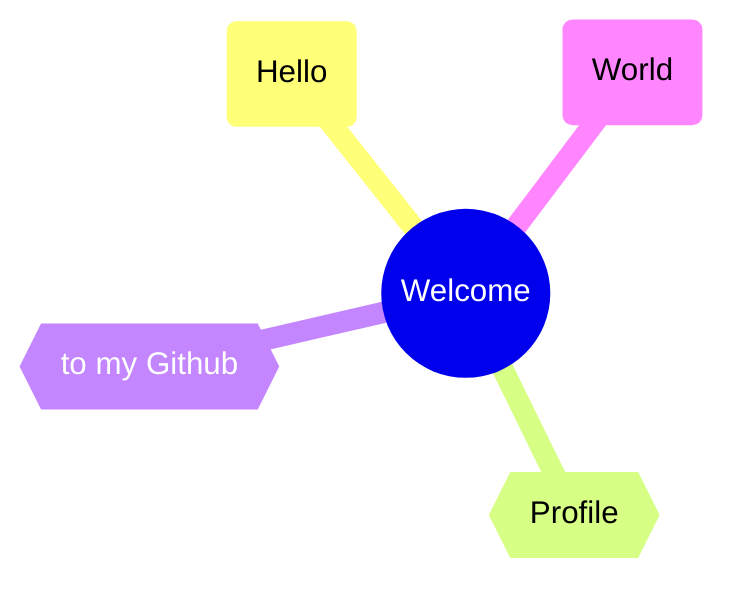
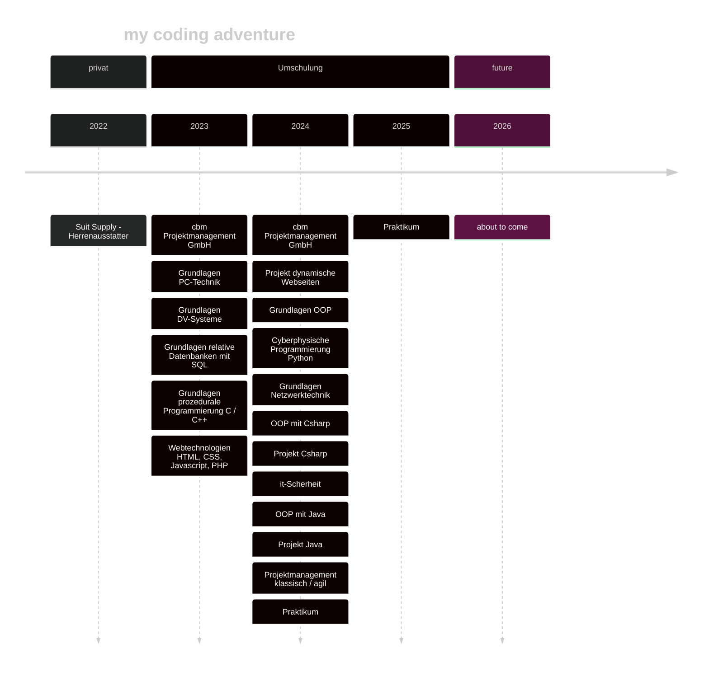

<p align="center">

</p>




## About me


```java
public class About extends Me{
    public String name = "Sadaf";
    public String city = "Hamburg";
    public String current_work = "Software Developer Apprentice";
    private String[] hobbies = { "Boxing", "Soccer referee", "Coding" };

    private void Ambitions() {
        FindInternship();
        CreateSkyNet();
    }
}
```




## projects
- Umschulung [@cbm](https://cbm-projektmanagement.de/) (Bildungsträger)
  - Vorlesung repositories 
    - [OOP c# @console](https://github.com/sdfhbb/cSharp)
    - [c++](https://github.com/sdfhbb/cpp)
    - [sql](https://github.com/sdfhbb/sql)
    - [php](https://github.com/sdfhbb/php)
    - [python](https://github.com/sdfhbb/python)
    - [c# advanced @console](https://github.com/SdfHbb/CSharpAdvancedConsole) `Modul für Anwendungsentwickler`
    - [c# @windowsForms](https://github.com/SdfHbb/cSharpWindowsForms) `Modul für Anwendungsentwickler`
  - Projekte
    - [SPDesign](https://github.com/P76ers/SPDesign/)  `Website about a men's outfitter @php`
    - [RessMan](https://github.com/SdfHbb/RessMan)  `Windows-Forms Warenwirtschaftssystem @c#`


## contact me

[](mailto:sadafhabib1989@gmail.com)

<a href="https://www.instagram.com/sdf.hbb/">
  
</a>

## Skills

<div> 
    <a href="https://devdocs.io/c/"></a>
  <a href="https://devdocs.io/cpp/"></a> 
  <a href="https://learn.microsoft.com/de-de/dotnet/csharp/"></a>   
  <a href="https://www.oracle.com/java/"></a>
  <a href="https://www.python.org/"></a>
  <br>

  <a href="https://html.spec.whatwg.org/multipage/"></a> 
  <a href="https://www.w3.org/Style/CSS/Overview.en.html"></a>
  <a href="https://developer.mozilla.org/en-US/docs/Web/JavaScript"></a> 
    <a href="https://www.php.net/"></a>
     <a href="https://www.markdownguide.org/"></a>
  <a href="https://mdxjs.com/"> </a><br>

  <a href="https://www.mysql.com/de/"></a>
  <a href="https://www.postgresql.org/"></a> 
  <br>


  <a href="https://git-scm.com/"></a> 
  <a href="https://github.com/"></a> <br>

  <a href="https://mermaid.js.org/"></a> 
  <a href="https://app.diagrams.net/"></a>
  <a href="https://xmind.app/"></a> <br>

  <a href="https://code.visualstudio.com/"></a>
  <a href="https://www.jetbrains.com/de-de/idea/"></a>
  <a href="https://www.jetbrains.com/de-de/pycharm/"></a>
  <a href="https://www.jetbrains.com/de-de/rider/"></a> 
</div>

## my stats


 

<picture>
  <source media="(prefers-color-scheme: dark)" srcset="https://raw.githubusercontent.com/sdfhbb/sdfhbb/output/github-contribution-grid-snake-dark.svg">
  <source media="(prefers-color-scheme: light)" srcset="https://raw.githubusercontent.com/sdfhbb/sdfhbb/output/github-contribution-grid-snake.svg">
  
</picture>
